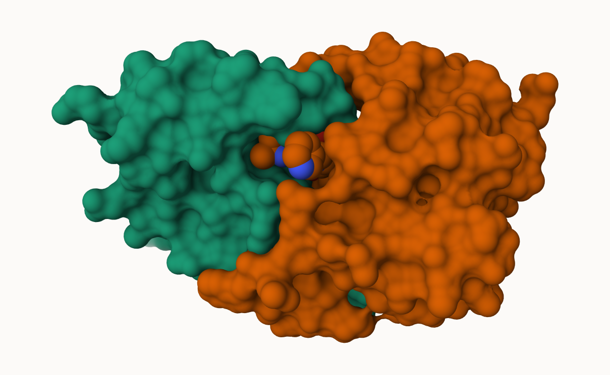

## PDB statistics

The Protein Data BAnk (PDB) is the amin repository of biomolecular structures. Let's see what it contains:

```{r}
stats <- read.csv("Data Export Summary.csv")
stats
```

```{r}
sum(stats$Neutron)
```

The comma in these numbers leads to the numbers here being read as character.

```{r}
c(100,10)
```

```{r}
library(readr)
stats <- read_csv("Data Export Summary.csv")
stats
```

```{r}
sum(stats$`X-ray`)
```

> Q1: What percentage of structures in the PDB are solved by X-Ray and Electron Microscopy.

```{r}
total_structures <- sum(stats$Total)
xray_percent <- sum(stats$`X-ray`) / total_structures * 100
em_percent <- sum(stats$EM) / total_structures * 100
xray_percent
```

```{r}
em_percent
```

> Q2: What proportion of structures in the PDB are protein?

```{r}
protein_percent <- stats$Total[stats$`Molecular Type`== "Protein (only)"] /
sum(stats$Total) * 100
protein_percent

```

## Visualizing the HIV-1 protease structure

We can use the Molsat viewer online: https://molstar.org/viewer/



A new clean image showing the catalytic ASP25 amino aicds in both chains of the HIV-PR dimer along with the inhibitor and the all important active site water.

## Bio3D package for structural bioinformatics


```{r}
options(repos = c(CRAN = "https://cran.rstudio.com/"))
```

```{r}

install.packages("pak")
pak::pak("bioboot/bio3dview")
install.packages("NGLVieweR")
```

```{r}
library(bio3dview) 

```

## Predicting functional motions of a single structure

Read on ADK structure form the PDB database

```{r}
adk <- read.pdb("6s36")
adk
```

```{r}
m <- nma(adk)
plot(m)
```

write our reuslts as a wee trajectory/movie of a predicted motions:

```{r}
mktrj(m, file="adk_m7.pdb")
```

```{r}
install.packages("png")
library(png) 
library(grid)
img <- readPNG("2HSG.png") 
grid.raster(img)
```

> Q4: Water molecules normally have 3 atoms. Why do we see just one atom per water molecule in this structure?

Hydrogen atoms are too small to produce strong electron density in X‑ray crystallography, so they usually aren’t visible in the resulting structure. Because of this, PDB files typically record only the oxygen atom for each water molecule.

> Q5: There is a critical “conserved” water molecule in the binding site. Can you identify this water molecule? What residue number does this water molecule have

The residue number that the water molecule have is 308.

> Q6: Generate and save a figure clearly showing the two distinct chains of HIV-protease along with the ligand. You might also consider showing the catalytic residues ASP 25 in each chain and the critical water (we recommend “Ball & Stick” for these side-chains). Add this figure to your Quarto document.

```{r}
install.packages("png")
library(png) 
library(grid)
img <- readPNG("1HSG.png") 
grid.raster(img)
```

```{r}
pdb <- read.pdb("1hsg")
```

```{r}
pdb
```

> Q7: How many amino acid residues are there in this pdb object?

198

> Q8: Name one of the two non-protein residues?

MK1 (indinavir)

> Q9: How many protein chains are in this structure?

There are 2 protein chains in this structure (chains A and B)

## Cooperative analysis with PCA

First step find and ADK sequence of :

```{r}
library(bio3d)
id <- "1ake_A"  ## Change this to fun a different analysis
aa <- get.seq( id)
```

```{r}
aa
```

next step, is search the PDB database foor all related entries:

```{r}
blast <- blast.pdb(aa)
hits <- plot (blast)
```

ALL the Blast results are here

```{r}
head (blast $hit.tbl )
```

The "top hits" are in the `hits` object. Now we can download these to our computer. Put these in a wee sub-folder (directory) called "pdbs" and use gzip tp speed things up

```{r}
# Download releated PDB files
files <- get.pdb(hits$pdb.id, path="pdbs", split=TRUE, gzip=TRUE)
```

We get a hot mess:


Next we will use the `pdalbn()` function to laign optionally fit (i.e. superpose) the identified PDB structures

This requires a BioConductor package called "msa" that we need to install. First we install BiocManager. Then we use `BiocManager::install("msa")`in

```{r}
# Align related PDBs
pdbs <- pdbaln(files, fit = TRUE, exefile="msa")
```

We could view these in R with **bio3dview** `view.pdbs()` function

```{r}
library(bio3dview)
view.pdbs(pdbs, colorScheme="residue")
```

## PCA

We can run PCA on our `pdbs` object using the `pca()` function form **bio3d**:

```{r}
pc.xray <- pca(pdbs)
plot(pc.xray)
```

```{r}
plot(pc.xray, 1:2)
```

We can make a visualilzation of the major conformational difference (i.e. large sclae structure change) captured by our PCA analysis with the `mktrj()` function

```{r}
pc1 <- mktrj(pc.xray, file="pca.pdb")
```

Let's see in Mol-star


```{r}
blast <- blast.pdb(aa)
hits <- plot (blast)
```
