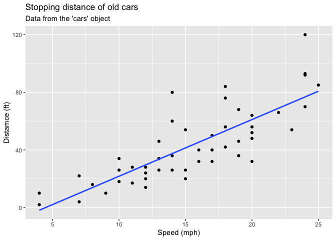
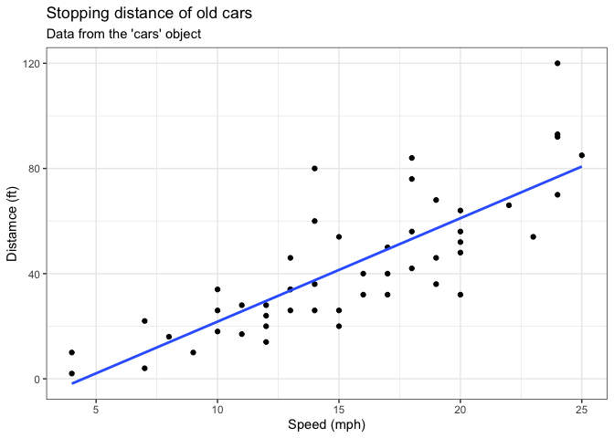
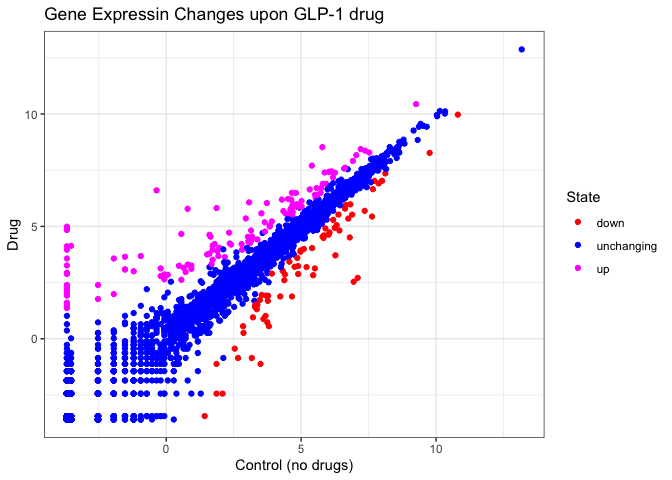
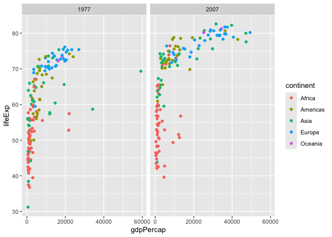

# Class 5: Data Viz with ggplot
Stephanie Solis (PID A18572681)

- [Background](#background)
- [Gene expression plot](#gene-expression-plot)
- [Going Further](#going-further)
- [Custom plots](#custom-plots)

## Background

There are lot’s of ways to amek figures in R. These include so-called
“base R” graphics (e.g. `plot()`) and tones of add-on packages
**ggplot2**.

For example here we make the same plot with both:

``` r
head(cars)
```

      speed dist
    1     4    2
    2     4   10
    3     7    4
    4     7   22
    5     8   16
    6     9   10

First I need to install the package with the command `install.package()`

> **N.B.** We never run on install cmd in a quarto code chunk or we will
> end up re-installing packages many many times-which is not what we
> want!

Everytime we want to use of these “add-on” packages we need to load it
up in R with the `lubrary()` function:

``` r
library(ggplot2)
```

``` r
ggplot(cars)
```


Every ggplot needs at least 3 things:

- The **data**, the stuff you want plotted
- The **aes**thitics, how the data map to the plot
- The **geom**etry, the type of plot

``` r
p <- ggplot(cars) +
  aes(x=speed, y=dist) +
  geom_point() + geom_smooth(method="lm",se=FALSE) + labs(title="Stopping distance of old cars", subtitle = "Data from the 'cars' object", x="Speed (mph)", y="Distamce (ft)")
```

render it out

``` r
p
```

    `geom_smooth()` using formula = 'y ~ x'



``` r
p+theme_bw()
```

    `geom_smooth()` using formula = 'y ~ x'



## Gene expression plot

We can read the input data from the class website

``` r
url <- "https://bioboot.github.io/bimm143_S20/class-material/up_down_expression.txt"
genes <- read.delim(url)
head(genes)
```

            Gene Condition1 Condition2      State
    1      A4GNT -3.6808610 -3.4401355 unchanging
    2       AAAS  4.5479580  4.3864126 unchanging
    3      AASDH  3.7190695  3.4787276 unchanging
    4       AATF  5.0784720  5.0151916 unchanging
    5       AATK  0.4711421  0.5598642 unchanging
    6 AB015752.4 -3.6808610 -3.5921390 unchanging

A first version plot

``` r
ggplot(genes)+ aes(Condition1, Condition2)+ geom_point()
```


``` r
table(genes$State)
```


          down unchanging         up 
            72       4997        127 

Version 2 let’s color by `State` so we can see the “up” and “down”
significant genes compared to all the unchanging genes

``` r
ggplot(genes)+ aes(Condition1, Condition2, col=State)+ geom_point()
```


Version 3 plots, let’s modify the default colors to something we like

``` r
ggplot(genes)+ aes(Condition1, Condition2, col=State)+ geom_point() + scale_colour_manual( values=c("red", "blue", "magenta")) + labs(x="Control (no drugs)", y="Drug", title= "Gene Expressin Changes upon GLP-1 drug") + theme_bw()
```



## Going Further

Let’s have a look at the famous **gapminder** dataset

``` r
# File location online
url <- "https://raw.githubusercontent.com/jennybc/gapminder/master/inst/extdata/gapminder.tsv"

gapminder <- read.delim(url)
```

``` r
head(gapminder, 3)
```

          country continent year lifeExp      pop gdpPercap
    1 Afghanistan      Asia 1952  28.801  8425333  779.4453
    2 Afghanistan      Asia 1957  30.332  9240934  820.8530
    3 Afghanistan      Asia 1962  31.997 10267083  853.1007

``` r
ggplot(gapminder)+ aes(gdpPercap, lifeExp,  col=continent) + geom_point(alpha=0.3)
```


Let’s “facet (i.e. make a separate plot) by continent rather than the
big hot mess above.

``` r
ggplot(gapminder) + aes(gdpPercap, lifeExp, col=continent) + geom_point(alpha=0.3) + facet_wrap(~continent)
```


## Custom plots

How big is this gapminder dataset?

``` r
nrow(gapminder)
```

    [1] 1704

I want to “filter” down to a subset of this data. I wil use the
**dplyr** package to help me.

First I need to install it and then load it up….
install.packages(“dplyr”) and then `library(dyplr)`

``` r
library(dplyr)
```


    Attaching package: 'dplyr'

    The following objects are masked from 'package:stats':

        filter, lag

    The following objects are masked from 'package:base':

        intersect, setdiff, setequal, union

``` r
gapminder_2007 <-filter(gapminder, year==2007)
head(gapminder_2007)
```

          country continent year lifeExp      pop  gdpPercap
    1 Afghanistan      Asia 2007  43.828 31889923   974.5803
    2     Albania    Europe 2007  76.423  3600523  5937.0295
    3     Algeria    Africa 2007  72.301 33333216  6223.3675
    4      Angola    Africa 2007  42.731 12420476  4797.2313
    5   Argentina  Americas 2007  75.320 40301927 12779.3796
    6   Australia   Oceania 2007  81.235 20434176 34435.3674

``` r
filter(gapminder_2007, country=="Ireland")
```

      country continent year lifeExp     pop gdpPercap
    1 Ireland    Europe 2007  78.885 4109086     40676

``` r
gapminder_2007 <-filter(gapminder, year==2007)
head(gapminder_2007)
```

          country continent year lifeExp      pop  gdpPercap
    1 Afghanistan      Asia 2007  43.828 31889923   974.5803
    2     Albania    Europe 2007  76.423  3600523  5937.0295
    3     Algeria    Africa 2007  72.301 33333216  6223.3675
    4      Angola    Africa 2007  42.731 12420476  4797.2313
    5   Argentina  Americas 2007  75.320 40301927 12779.3796
    6   Australia   Oceania 2007  81.235 20434176 34435.3674

``` r
filter(gapminder_2007, country=="United States")
```

            country continent year lifeExp       pop gdpPercap
    1 United States  Americas 2007  78.242 301139947  42951.65

> Q. Make a plot comparing 1997 and 2007 for all countries

``` r
input <- filter(gapminder, year %in% c(1977, 2007))
head (input)
```

          country continent year lifeExp      pop gdpPercap
    1 Afghanistan      Asia 1977  38.438 14880372  786.1134
    2 Afghanistan      Asia 2007  43.828 31889923  974.5803
    3     Albania    Europe 1977  68.930  2509048 3533.0039
    4     Albania    Europe 2007  76.423  3600523 5937.0295
    5     Algeria    Africa 1977  58.014 17152804 4910.4168
    6     Algeria    Africa 2007  72.301 33333216 6223.3675

``` r
input <- filter(gapminder, year %in% c(1977,2007))

ggplot(data=input, aes(gdpPercap, lifeExp, col=continent)) + geom_point() +facet_wrap(~year)
```


