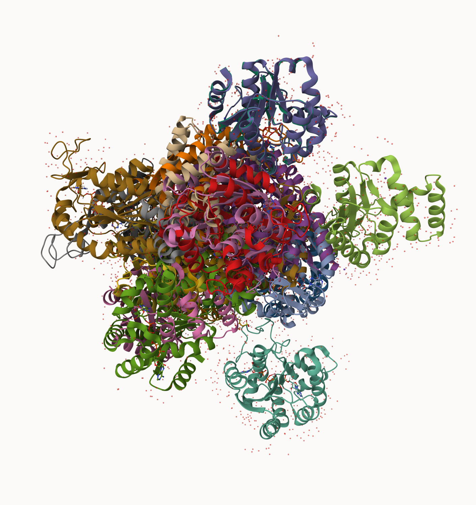
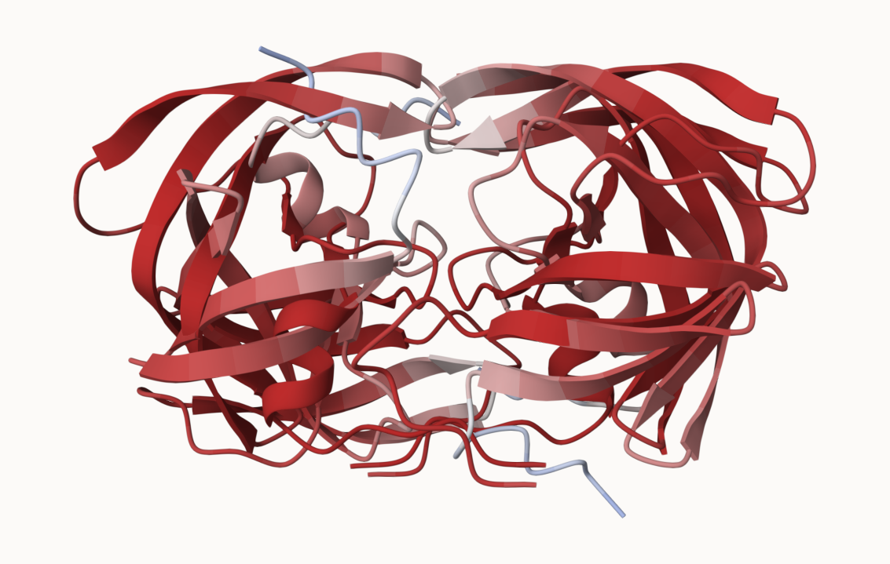

## Cooperative analysis with PCA

First step find and ADK sequence of :

```{r}
library(bio3d)
id <- "1ake_A"  ## Change this to fun a different analysis
aa <- get.seq( id)
```

```{r}
aa
```

next step, is search the PDB database foor all related entries:

```{r}
#blast <- blast.pdb(aa)
#hits <- plot (blast)
```

ALL the Blast results are here

```{r}
#head (blast $hit.tbl )
```

The "top hits" are in the `hits` object. Now we can download these to our computer. Put these in a wee sub-folder (directory) called "pdbs" and use gzip tp speed things up

```{r}
# Download releated PDB files
files <- get.pdb(hits$pdb.id, path="pdbs", split=TRUE, gzip=TRUE)
```

We get a hot mess: 

Next we will use the `pdalbn()` function to laign optionally fit (i.e. superpose) the identified PDB structures

This requires a BioConductor package called "msa" that we need to install. First we install BiocManager. Then we use `BiocManager::install("msa")`in

```{r}
# Align related PDBs
pdbs <- pdbaln(files, fit = TRUE, exefile="msa")
```

We could view these in R with **bio3dview** `view.pdbs()` function

```{r}
library(bio3dview)
view.pdbs(pdbs, colorScheme="residue")
```

# PCA

We can run PCA on our `pdbs` object using the `pca()` function form **bio3d**:

```{r}
pc.xray <- pca(pdbs)
plot(pc.xray)
```

```{r}
plot(pc.xray, 1:2)
```

We can make a visualilzation of the major conformational difference (i.e. large sclae structure change) captured by our PCA analysis with the `mktrj()` function

```{r}
pc1 <- mktrj(pc.xray, file="pca.pdb")
```

Let's see in Mol-star

## Background

we saw last day that the main repository for biomolecular structure (the PDB datatbase) only has \~250,000 entries

UnitProtKB (the main protein sequence database) has over 200 million entries!

In this hands-on session we will utilize AlphaFold to predict protein structure from sequence (Jumper et al, 2021),

Without the aid of such approaches, it can take years of expensive Laboratory work to determine the structure of just one protein. With Alphafold me can now accurately compute a typical protein structure in as little as ten minutes.

## The EBI AlphaFold database

The EBI database contains lots of computed structure models. it is increasingly likelky that the structure you are interest in is already in this database at https://alphafold.ebi.ac.uk \>

There are 3 major outputs form ALphaFold

1.  A model of structure in **PDB** format.
2.  a **PLDDT score**: that tells us how confident the model is for a given residue in your protein (High values are good, above 70)
3.  a **PAE score** that tells us about protein packing quality

If you can't find a matching entry for the sequnec you ar einterested in AFDB you can run AlphaFold yourself...

## Running AlphaFold

We will use ColabFold to run AlphaFold on our sequence \< https://colab.research.google.com/github/sokrypton/ColabFold/blob/main/AlphaFold2.ipynb

Figure form AlphaFold here!

```{r}
library(png)
library(grid)

img <- readPNG("HIVPR_23119.png")
grid.raster(img)

```

## Interpreting Results

Custom ananlysis of resulting models

We can read all the Alpha Fold rsults into R and do more quantitative analysis than just viewing the structure in Mol-star:

Read all the PDB models:

```{r}
library(bio3d)
p <- read.pdb("hivpr_23119/hivpr_23119_unrelaxed_rank_001_alphafold2_multimer_v3_model_4_seed_000.pdb")
```

```{r}
results_dir <-list.files("hivpr_23119/", pattern= ".pdb", full.names =T)
```

```{r}
results_dir <- "hivpr_23119/"
pdb_files <- list.files(path=results_dir,
                        pattern="*.pdb",
                        full.names = TRUE)
print(pdb_files)
pdbs <- pdbaln(pdb_files, fit=TRUE, exefile="msa")
```

How similar or different are my models?

```{r}
rd <- rmsd(pdbs)
library(pheatmap)
colnames(rd) <- paste0("m",1:5)
rownames(rd) <- paste0("m",1:5)
pheatmap(rd)
```

```{r}
pdb <- read.pdb("1hsg")

plotb3(pdbs$b[1,], typ="l", lwd=2, sse=pdb)
points(pdbs$b[2,], typ="l", col="red")
points(pdbs$b[3,], typ="l", col="blue")
points(pdbs$b[4,], typ="l", col="darkgreen")
points(pdbs$b[5,], typ="l", col="orange")
abline(v=100, col="gray")
```


